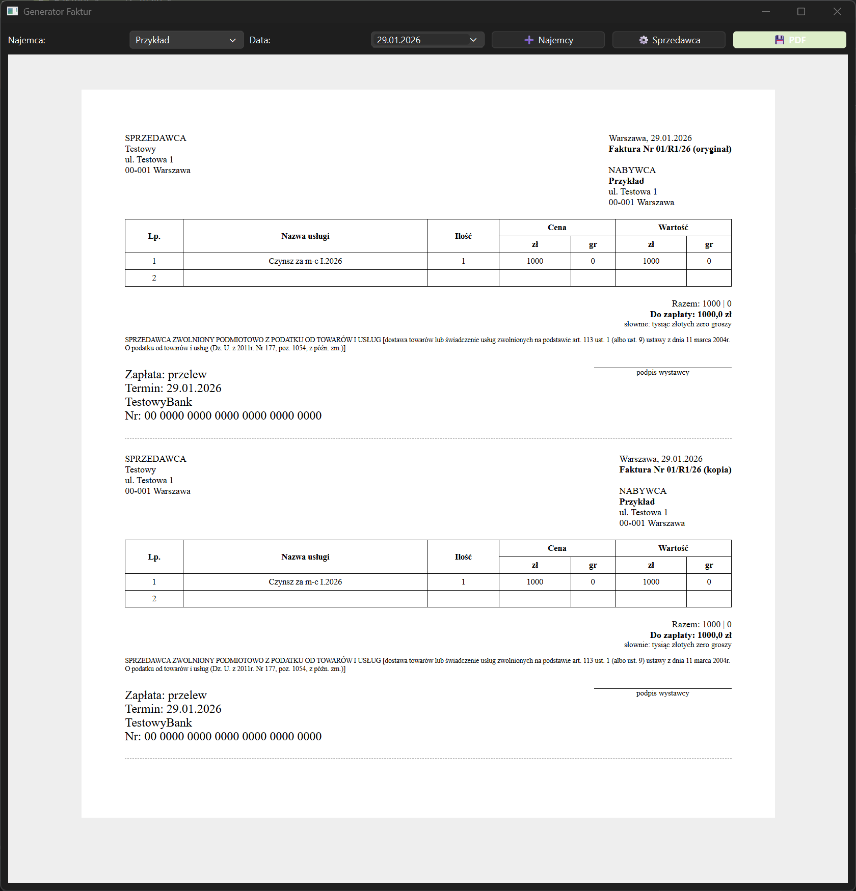

# RentManager-App 📄🏢

**RentManager-App** to lekka aplikacja desktopowa stworzona w Pythonie, która upraszcza proces wystawiania faktur za wynajem nieruchomości. Dzięki wbudowanemu silnikowi renderującemu, pozwala na błyskawiczne generowanie dokumentów PDF z zachowaniem profesjonalnego wyglądu (oryginał + kopia na jednej stronie).



## 🚀 Kluczowe Funkcje
* **Baza Najemców:** Zarządzaj listą kontrahentów, ich adresami oraz indywidualnymi stawkami czynszu.
* **Automatyczne Kwoty Słownie:** System automatycznie konwertuje wartości liczbowe na tekst w języku polskim.
* **Podgląd w Czasie Rzeczywistym:** Możliwość edycji danych bezpośrednio w oknie aplikacji przed wygenerowaniem PDF.
* **Eksport do PDF:** Generowanie gotowych dokumentów jednym kliknięciem.
* **Lokalna Baza Danych:** Wszystkie ustawienia i dane najemców są bezpiecznie przechowywane lokalnie w formacie JSON.

## 🛠️ Stos Technologiczny
* **Język:** Python 3.x
* **Interfejs:** PyQt6
* **Silnik Dokumentów:** PyQt6-WebEngine (HTML5/CSS3)
* **Format zapisu:** JSON

## 📦 Instalacja i Uruchomienie

1. **Pobierz kod:**
   ```git clone [https://github.com/MrRobinMr/RentManager-App.git](https://github.com/MrRobinMr/RentManager-App.git)```
   ```cd RentManager-App```

2. **Zainstaluj zależności:**
   ```pip install -r requirements.txt```

3. **Uruchom program:**
   ```python main.py```

## 🏗️ Kompilacja do pliku .exe
Jeśli chcesz przygotować wersję wykonywalną dla systemu Windows:
```pyinstaller --noconsole --onefile main.py```

## 📝 Autor
**Jakub Nowak** – [Profil GitHub](https://github.com/MrRobinMr)

---
*Projekt stworzony w celu automatyzacji domowych rozliczeń i nauki biblioteki PyQt6.*
